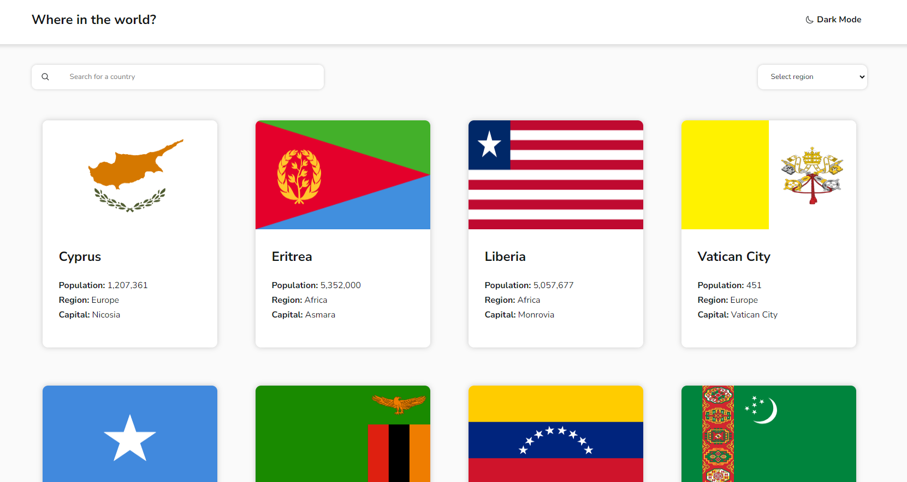

# Country Search API
This project is a Frontend Mentor challenge project that utilizes HTML, CSS, and React to create a country search app using a REST country API. The application allows users to search and filter through countries based on input and regions. The country cards show some simple information, and upon clicking the country card, the app will redirect the user to the specific country page where more detailed information can be viewed. Users are able to navigate the pages through the implementation of react router. 

The application also contains a theme switcher that allows users to toggle between light mode and dark mode.

**Preview of the country search page:**  

## View Site
Link: https://deep-git.github.io/country-search/

## Technologies Utilized
- HTML
- CSS
- React
- Vite
